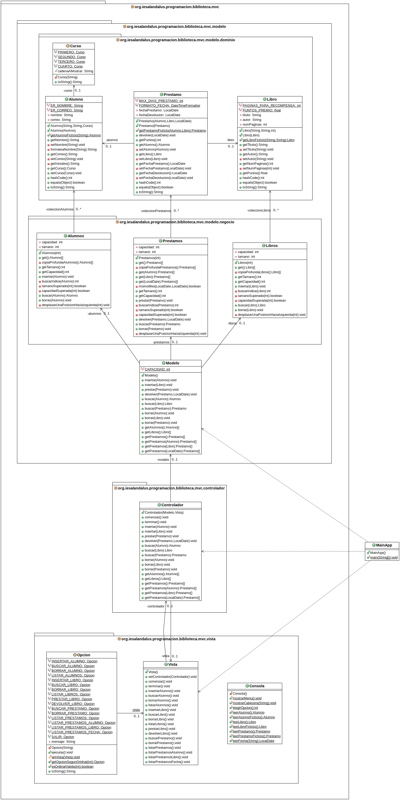

# Tarea: Biblioteca IES Al-Ándalus
## Profesor: José Ramón Jiménez Reyes
## Alumno:

En el IES Al-Ándalus, para fomentar la lectura, animan al alumnado a que se lea libros de la biblioteca y así consiga puntos para la aplicación ClassDojo que al final de trimestre pueden repercutir en diversos premios. Los puntos obtenidos por el préstamo de cada libro dependerán del número de páginas del libro y del número de días que lo haya tenido prestado. Después de todas las especificaciones y requerimientos anotados, en este **primer spring** de la aplicación se ha decidido abarcar los siguientes:

- En la biblioteca del centro hay muchos libros impresos. Los **libros** se identifican por el **título**, el **autor** y el **número de páginas** de cada uno de ellos. Sólo hay un ejemplar de cada libro. Se considera que dos libros son los mismos si tienen el mismo título y autor. Una vez creado un libro no se puede cambiar ninguna de sus propiedades. Los puntos que se obtienen al realizar el préstamo de un libro dependen del número de páginas del mismo. Obtendremos 0,5 puntos por cada 25 páginas del libro: de 0-24 obtenemos 0,5 puntos, de 25-49 obtenemos 1 puntos, de 50-74 obtenemos 1,5 puntos, etc. La aplicación permitirá **insertar** un libro, **buscar** un libro, **borrar** un libro y **listar** todos los libros existentes.
- Un **alumno** se identifica por su **nombre** (que constará de al menos dos palabras correspondientes al nombre y un apellido), su **correo** electrónico (que debe ser correcto) y su **curso**. Una vez creado un alumno no podremos cambiarle ni el nombre, ni el correo electrónico pero si podremos cambiarle el curso. Se considera que dos alumnos son los mismos si su correo electrónico es el mismo. Para almacenar el nombre del alumno lo formatearemos eliminando espacios en blanco sobrantes y poniendo la primera letra de cada palabra en mayúsculas y las siguientes en minúsculas. Para mostrar un alumno, mostraremos su nombre, seguido de sus iniciales, su correo electrónico y su curso. La aplicación permitirá **insertar** un alumno, **borrar** un alumno basándonos en el correo electrónico del mismo, **buscar** un alumno basándonos en el correo electrónico del mismo y **listar** los alumnos dados de alta.
- Un alumno puede realizar el **préstamo** de un libro en una fecha concreta. Permitimos que las **fechas de préstamo** sean pasadas ya que algunas veces no se registran en el instante y se registran con posterioridad. Un mismo alumno no podrá realizar el préstamo de un libro más de una vez, por lo que consideramos dos préstamos iguales si el alumno y el libro son iguales. Una vez que el alumno se lee el libro, lo devolverá y anotaremos la **fecha de devolución** que también puede ser pasada (por el mismo motivo que para el préstamo), pero que si debe ser posterior a la fecha del préstamo. Por cada préstamo el alumno obtendrá unos puntos que dependerán del número de páginas del libro, es decir, de los puntos que nos otorga haber realizado el préstamo de ese libro y del número de días que lo hemos tenido en nuestro poder. Si el número de días del préstamo supera el máximo de días que es 20, no obtendremos ningún punto. Si no los supera, obtendremos los puntos equivalentes a dividir el máximo de días entre los puntos que nos otorga el libro multiplicado por el máximo de días. Todo ello lo redondearemos y así sabremos los puntos obtenidos por dicho préstamo. La aplicación permitirá **realizar un préstamo** de un libro por un alumno, **devolver** un libro por un alumno, **buscar** un préstamo, **borrar** un préstamo, **listar todos** los prestamos, **listar** los préstamos de un **alumno dado**, **listar** los préstamos de **libro dado** y **listar** los préstamos realizados en un **mes dado** (dada una fecha).
- En este spring no contemplaremos ninguna restricción más ni a la hora de insertar ni a la hora de borrar, por lo que se podrán quedar datos inconsistentes que ya abarcaremos en el siguiente spring.

Tu tarea consiste en realizar una aplicación para gestionar los préstamos de la biblioteca del IES Al-Ándalus. Con los conocimientos adquiridos hasta el momento realizaremos una implementación basada en arrays para gestionar las colecciones. Aplicaremos el patrón MVC (haciendo una primera aproximación al mismo que poco a poco iremos mejorando cuando adquiramos los conocimientos necesarios) por lo que haremos una distinción entre la **vista** (encargada de interaccionar con el usuario), el **modelo** (encargado de gestionar los datos) que dividiremos entre clases de dominio (DTO) y clases de negocio (DAO) que nos permiten interactuar con las colecciones y el **controlador** (encargado de dirigir toda esta orquesta).

Debes tener en cuenta el problema existente con las referencias (aunque en principio no podamos modificar ninguno de los atributos de las clases expuestas -se consideran clases inmutables-, quiero que te acostumbres a tenerlo en cuenta). Por ello para cada clase que sea cliente de otra deberás devolver referencias a objetos nuevos en los métodos de acceso y también crear nuevas referencias a nuevos objetos cuando los vayamos a asignar a atributos. En los métodos de las clases de negocio también deberás devolver una copia profunda de los elementos de la colección en dicho método de acceso.

También siempre se deben validar todos los valores que se intentan asignar y si no lanzar una excepción adecuada para evitar inconsistencias en el estado de los objetos.

Para ello te pongo un diagrama de clases para el mismo y poco a poco te iré explicando los diferentes pasos a realizar:

He subido a GitHub un esqueleto de proyecto gradle que ya lleva incluidos todos los test necesarios que el programa debe pasar. Dichos test están todos comentados y deberás ir descomentándolos conforme vayas avanzando con la tarea. La URL del repositorio es en la que te encuentras.

Por tanto, tu tarea va a consistir en completar los siguientes apartados:

1. Lo primero que debes hacer es realizar un **fork** del repositorio donde he colocado el proyecto gradle con la estructura del proyecto y todos los test necesarios. Clonar tu repositorio remoto recién copiado en github a un repositorio local que será donde irás realizando lo que a continuación se te pide. Añade tu nombre al fichero `README.md` en el apartado "Alumno". Realiza tu primer commit.
2. Crea el enumerado `Curso`, en el paquete adecuado con las siguientes instancias (`PRIMERO`, `SEGUNDO`, `TERCERO` y `CUARTO`). Cada instancia aceptará en su constructor el texto a mostrar por el método toString (1º ESO, 2º ESO, 3º ESO y 4º ESO).
3. Crea la clase `Alumno`, en el paquete adecuado, con los atributos y métodos especificados en el diagrama y la visibilidad adecuada. Crea el **constructor con parámetros** y el **constructor copia**. Crea los métodos `get` y `set` con la visibilidad adecuada. En todos los casos se debe comprobar la validez de los parámetros pasados antes de asignarlos y en caso de que no sean válidos lanzar la excepción adecuada. Ten en cuenta los requisitos comentados al principio y recuerda formatear el nombre adecuadamente. El método `getAlumnoFicticio` simplemente devolverá un alumno con un nombre válido y curso válido y el correo pasado por parámetro y que luego utilizaremos para las búsquedas y los borrados. Crea los métodos `hashCode`, `equals` y `toString`. Asegurate de que se pasan todos los tests asociados a esta clase. Realiza el commit correspondiente.
4. Crea la clase `Libro`, en el paquete adecuado, con los atributos y métodos especificados en el diagrama y la visibilidad adecuada. Crea el **constructor con parámetros** y el **constructor copia**. Crea los métodos `get` y `set` con la visibilidad adecuada. En todos los casos se debe comprobar la validez de los parámetros pasados antes de asignarlos y en caso de que no sean válidos lanzar la excepción adecuada. Ten en cuenta los requisitos comentados al principio. El método `getLibroFicticio` simplemente devolverá un profesor con un número de páginas válido y el título y autor pasados por parámetros y que luego utilizaremos para las búsquedas y borrados. Crea los métodos `hashCode`, `equals` y `toString`. Asegurate de que se pasan todos los tests asociados a esta clase. Realiza el commit correspondiente.
5. Crea la clase `Prestamo`, en el paquete adecuado, con los atributos y métodos especificados en el diagrama y la visibilidad adecuada. Crea el **constructor con parámetros** y el **constructor copia**. Crea los métodos `get` y `set` con la visibilidad adecuada. En todos los casos se debe comprobar la validez de los parámetros pasados antes de asignarlos y en caso de que no sean válidos lanzar la excepción adecuada. Ten en cuenta los requisitos comentados al principio. El método `getPrestamoFicticio` simplemente devolverá un préstamo con una fecha de préstamo válida y el alumno y libro ficticios correspondientes al correo, título y autor pasados por parámetros. Crea los métodos `hashCode`, `equals` y `toString`. Asegurate de que se pasan todos los tests asociados a esta clase. Realiza el commit correspondiente.
6. Crea la clase `Alumnos`, en el paquete adecuado, con los atributos y métodos especificados en el diagrama y la visibilidad adecuada. Recuerda que el método `get` devolverá una copia profunda de la colección. Se permitirá **insertar** elementos al final de la colección sin admitir repetidos, **buscar** y **borrar** desplazando los elementos hacia la izquierda para dejar el array compactado. Asegurate de que se pasan todos los tests asociados a esta clase. Realiza el commit correspondiente.
7. Crea la clase `Libros`, en el paquete adecuado, con los atributos y métodos especificados en el diagrama y la visibilidad adecuada. Recuerda que el método `get` devolverá una copia profunda de la colección. Se permitirá **insertar** elementos al final de la colección sin admitir repetidos, **buscar** y **borrar** desplazando los elementos hacia la izquierda para dejar el array compactado. Asegurate de que se pasan todos los tests asociados a esta clase. Realiza el commit correspondiente.
8. Crea la clase `Prestamos`, en el paquete adecuado, con los atributos y métodos especificados en el diagrama y la visibilidad adecuada. Recuerda que los métodos `get` devolverán una copia profunda de la colección resultante. Se permitirá **prestar**(insertar) elementos al final de la colección sin admitir repetidos, **devolver**, **buscar** y **borrar** desplazando los elementos hacia la izquierda para dejar el array compactado. Asegurate de que se pasan todos los tests asociados a esta clase. Realiza el commit correspondiente.
9. Crea la clase `Modelo`, en el paquete adecuado, con los atributos y métodos especificados en el diagrama y la visibilidad adecuada. Cada método deberá hacer una llamada al método homólogo del objeto adecuado. Asegurate de que se pasan todos los tests asociados a esta clase. Realiza el commit correspondiente.
10. Crea la clase `Consola`, en el paquete adecuado, teniendo en cuenta que será una clase de utilidades de la cual no queremos que se puedan instanciar objetos. Crea los métodos especificados en el diagrama, teniendo en cuenta que cada uno de los métodos realizará la función que su nombre indica, es decir, pedir por teclado las variables convenientes, que en algunos casos deberá transformar como en el caso de las fechas, para poder devolver el objeto de dominio correspondiente. El método `mostrarCabecera` mostrará la cadena pasada por parámetro y debajo de la misma una cadena compuesta de tantos caracteres '-' como su longitud. Realiza el commit correspondiente.
11. Crea el enumerado `Opcion`, en el paquete adecuado, cuyas instancias corresponderán con cada una de las opciones del menú de nuestra aplicación. Cada instancia aceptará en su constructor una cadena correspondiente al mensaje que se mostrará por pantalla para dicha opción. Debes crear los atributos y métodos que se especifican en el diagrama, teniendo en cuenta que el método `ejecutar` es abstracto por lo que en la declaración general no tendrá implementación, pero que deberá ser implementado en cada una de las instancias haciendo una llamada al correspondiente método de la clase `Vista`. El método getOpcionSegunOrdinal devolverá la instancia de Opcion que ocupe el ordinal pasado por parámetro. El método `esOrdinalValido` devolverá un `boolean` indicando si el ordinal pasado por parámetro está dentro de los posibles ordinales. El método `toString` devolverá la cadena correspondiente a la concatenación del ordinal de la opción, la cadena " .- " y el mensaje a mostrar por la opción en cuestión. Por último, el método `setVista` asignará el valor pasado al atributo `vista`, que aunque aún no exista, crearás en el siguiente paso. Realiza el commit correspondiente.
12. Crea la clase `Vista`, en el paquete adecuado, con los atributos y métodos especificados en el diagrama. Esta clase hará uso de los métodos de la clase `Consola` para pedir los datos y llamará al método adecuado de la clase `Controlador`. El método `comenzar` será un bucle que mostrará el menú, pedirá la opcion deseada y la ejecutará, así hasta que la opción elegida sea `SALIR`. El método `terminar` simplemente llamará al método `terminar` de la clase `Controlador`. Realiza el commit correspondiente.
13. Crea la clase `Controlador`, en el paquete adecuado, con los atributos y métodos especificados en el diagrama. Esta clase asignará los valores a los atributos y llamará al método `setControlador` de la clase `Vista` para que dicha clase tenga una referencia a ésta. El método `comenzar` llamará al método `comenzar` de la vista. Los demás métodos llamarán a sus métodos homólogos de la clase `Modelo`. Realiza el commit correspondiente.
14. Crea la clase `MainApp` que simplemente creará un objeto de la clase `Modelo`, otro de la clase `Vista` y otro de la clase `Controlador` pasándole los dos anteriores y luego llamará al método `comenzar`. Realiza el commit correspondiente.

###### Se valorará:
- La indentación debe ser correcta en todas las clases.
- El nombre de las variables debe ser adecuado.
- Se debe utilizar la clase `Entrada` para realizar la entrada por teclado.
- El proyecto debe pasar todas las pruebas que van en el esqueleto del mismo y toda entrada del programa será validada para evitar que el programa termine abruptamente debido a una excepción.
- Se deben utilizar los comentarios adecuados.
- Se valorará la corrección ortográfica tanto en los comentarios como en los mensajes que se muestren al usuario.

